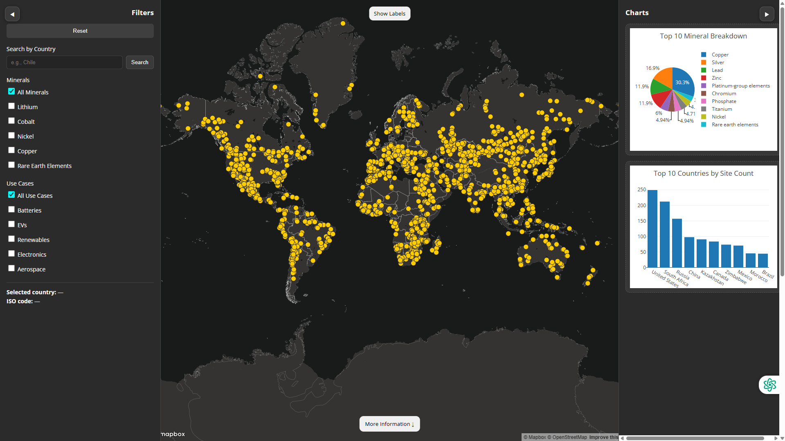

# Critical Minerals Smart Dashboard

<p align="center">
  
</p>

## Live Dashboard

View the interactive dashboard here:
https://sirwillphil.github.io/Critical-Minerals-Smart-Dashboard/

---

## Authors

Will Seneko

Kenneth Ha

Evan Luong

Li-An Song

---

## Project Overview

The **Critical Minerals Smart Dashboard** is an interactive geospatial visualization tool designed to explore the global distribution of critical mineral deposits. These minerals are essential to modern technologies and play an important role in industries such as renewable energy, electric vehicles, electronics, and aerospace manufacturing.

The dashboard allows users to interactively explore where mineral deposits are located around the world and better understand how these resources support global supply chains and technological development.

---

## Dashboard Features

### Interactive Global Map

* Displays hundreds of mineral deposit locations worldwide
* Built using **Leaflet** with a Mapbox basemap
* Users can zoom, pan, and explore spatial patterns of deposits

### Country Search

* Search for a specific country
* Highlights mineral deposits associated with that country

### Mineral Filters

Users can filter deposits by mineral type:

* Lithium
* Cobalt
* Nickel
* Copper
* Rare Earth Elements

### Industry Use Case Filters

Users can explore minerals used in:

* Batteries
* Electric Vehicles
* Renewable Energy
* Electronics
* Aerospace

### Dynamic Charts

The dashboard includes two charts that summarize mineral data:

**Top 10 Mineral Breakdown**

* Pie chart showing the distribution of major minerals in the dataset

**Top 10 Countries by Site Count**

* Bar chart showing countries with the highest number of mineral deposits

### Map Controls

* Toggle map labels on/off
* Reset filters and selections
* Expand or collapse filter and chart panels

---

## How to Use the Dashboard

1. Open the live dashboard.
2. Explore mineral deposit locations on the global map.
3. Use the **Search by Country** feature to focus on a specific region.
4. Apply filters to explore mineral types and industry uses.
5. View the charts to analyze mineral distribution patterns.

---

## Project Goal

The goal of this project is to create an intuitive visualization tool that helps users understand the geographic distribution of critical minerals and their importance in global energy systems, manufacturing, and emerging technologies.

By combining geospatial mapping with interactive charts and filtering tools, the dashboard provides insights into how mineral resources are distributed across the world.

---

## Technologies Used

* HTML
* CSS
* JavaScript
* Leaflet.js
* Mapbox Basemap
* Chart.js
* GeoJSON Data

---

## Repository Structure

```
Critical-Minerals-Smart-Dashboard
│
├── index.html
├── map1.html
├── map2.html
├── charts.html
├── css/
├── js/
├── assets/
├── README.md
└── .DS_Store
```

---

## Acknowledgements

This project was developed as part of a geospatial data visualization and analytics coursework project for GEOG458.
